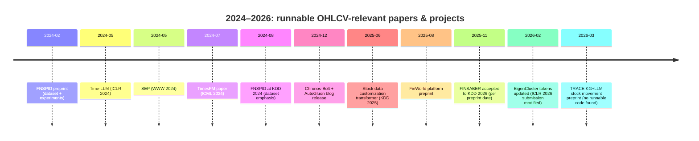

# Recent academic and open-source approaches for predicting market movements from daily OHLCV

## Executive summary

Daily OHLCV-only prediction for broad indices is still a **low-signal, high-noise** setting; most “wins” in recent papers come from (a) **stronger evaluation discipline (bias-aware backtests, robust splits)** and/or (b) **expanding information beyond OHLCV** (news, filings, multi-asset universes) rather than from simply “fine-tuning an LLM on one index series.” citeturn22view0turn24view0turn28view0turn30view0

Across 2024–2026, the most runnable, notebook-friendly work relevant to your goal clusters into three buckets:

1) **Bias-aware evaluation/backtesting frameworks** that make it hard to accidentally overstate performance (highest ROI if you care about scientific correctness and deployability). The standout is **FINSABER** (accepted to KDD 2026) with code + datasets and a pipeline designed to mitigate survivorship/look-ahead/data-snooping bias. citeturn22view0turn24view0

2) **Financial datasets and end-to-end platforms** that package OHLCV plus optional text, factors, and environments, with runnable scripts. Representative examples include **FNSPID** (KDD 2024 dataset + scrapers/experiments) and **FinWorld** (2025 “all-in-one” platform, albeit preview). citeturn28view1turn29view1turn20view0

3) **Modern time-series Transformers / time-series foundation models (TSFMs)** with clean APIs (often easier than “LLM fine-tuning”), including **PatchTST implementations**, **TimesFM**, and **Chronos/Chronos‑Bolt**. These are primarily forecasting models; you typically convert forecasts into trading signals (e.g., predicted return sign or triple-barrier outcomes). citeturn30view0turn25view3turn32view0turn25view2turn31search0

For practical experimentation in Claude Code-like notebooks with daily S&P 500 OHLCV, the best “first stack” is:

- **Walk-forward evaluation with embargo**, with at least one **transaction-cost-aware backtest** (even if simplistic). citeturn22view0turn33search8turn33search9  
- **LightGBM baseline** on engineered OHLCV features (hard to beat on small data; serves as an honest yardstick). citeturn20view0turn34view2turn31search10  
- Then add one deep model (e.g., **PatchTST**) and one TSFM (e.g., **TimesFM** or **Chronos‑Bolt**) to compare against the baseline. citeturn17view0turn31search0turn30view0turn32view0  

## What’s actually “tunable” with daily OHLCV and why most LLM work uses wrappers

A single daily index series (even 15–30 years) is “small data” for deep models, especially if you do proper walk-forward evaluation and avoid leakage. Many modern works therefore either:

- **Go cross-sectional / multi-asset** (e.g., forecast many stocks jointly, then form portfolios), which creates much more supervised signal. citeturn34view3turn24view0turn29view2  
- **Use multimodal context** (news/filings/factors) and treat prediction as a decision-making pipeline rather than pure forecasting. citeturn22view0turn24view0turn28view0turn20view0  
- Or use **TSFMs** that are pretrained elsewhere and applied in **zero-shot / lightweight adaptation** modes, which can be easier than training from scratch. citeturn30view0turn32view0turn25view2  

This is also why several “LLM-based trading” papers emphasize that **evaluation biases** and **short/handpicked symbol sets** can inflate results; robust, longer-horizon testing often erodes claimed advantages. citeturn22view0turn23view0

image_group{"layout":"carousel","aspect_ratio":"16:9","query":["TimesFM time series foundation model diagram","Chronos-Bolt AutoGluon time series forecasting diagram","PatchTST time series transformer patching diagram","Temporal Fusion Transformer architecture diagram"],"num_per_query":1}

## Prioritized shortlist of representative papers and projects from 2024–2026

The priority ranking below is **task-fit + runnable code + evaluation seriousness** for daily OHLCV market-movement work, not “best reported accuracy.” All items have public paper/project pages and runnable code or consumable artifacts, with constraints noted.

**Legend**  
- **Inputs**: Raw OHLCV vs engineered features (technical indicators, learned embeddings, tokenization).  
- **Label/Target**: next-day direction, k-day return, close-price forecast, portfolio return ranking, triple-barrier-like trade outcome.  
- **Backtest / Tx cost**: whether there is an explicit simulation layer and whether transaction costs/slippage are modeled.

| Priority | Paper / project (year) | Model type(s) | Dataset used (as released) | Label / target | Metrics reported | Code artifact runnable in notebooks | Inputs: raw vs engineered | Backtest / tx-cost-aware | Key constraints / notes |
|---:|---|---|---|---|---|---|---|---|---|
| 1 | **FINSABER** (accepted KDD 2026) | Bias-aware backtest framework + strategy zoo (rule-based, ML/DL, RL, LLM agents) | Multi-source data 2000–2024; includes daily prices and historically accurate universes; provides aggregated Hugging Face datasets (incl. S&P 500 “price only” and full aggregated) | Trading signals (Buy/Hold/Sell) and strategy performance over rolling windows; includes regime labeling by annual index returns | Return + risk metrics (Sharpe/Sortino etc.), robustness analyses, bias mitigation focus | GitHub: waylonli/FINSABER; datasets auto-downloaded; Backtrader-based timing strategies | Mixed: prices + indicators; optional news/filings for LLM strategies | Backtest: **Yes**; tx cost: **not explicitly documented** in README (treat as configurable/extend) | Requires keys for some LLM strategies; strong focus on long-horizon evaluation and bias mitigation citeturn22view0turn24view0turn23view0turn36view0 |
| 2 | **FinWorld** platform (2025) | End-to-end financial AI platform (forecasting + trading + portfolio + LLM agents) | Claims coverage across DJ30, SP500, SSE50, HS300; supports OHLCV, indicators, factors, news, reports; scripts to download data | Task-dependent: forecasting metrics; trading/portfolio metrics; LLM tasks | Reports MAE/MSE and RankICIR for forecasting; supports multiple paradigms | GitHub: TradeMaster-NTU/FinWorld with scripts/configs/examples | Mixed: OHLCV + engineered factors; optional text | Backtest: **Yes** (platform includes trading/portfolio modules); tx cost: unclear | Marked “preview version,” some components incomplete; GPU + RAM requirements listed citeturn20view0turn3view0 |
| 3 | **FNSPID** dataset + experiments (KDD 2024) | Dataset + baseline DL models (CNN/RNN/LSTM/GRU/Transformer/TimesNet) and sentiment pipelines | 29.7M stock price records + 15.7M news records for 4,775 S&P 500 companies (1999–2023), sourced via public pipelines | Close-price forecasting with/without sentiment features; uses windows (e.g., 50-day history → 3-day horizon in examples) | MAE, MSE, correlation (R), plus comparisons across models | GitHub: Zdong104/FNSPID_Financial_News_Dataset; dataset hosted on Hugging Face; includes scraper and experiment scripts | OHLCV available (Open/High/Low/Close/Adj/Volume shown); some experiments use subsets (open/close/volume + sentiment) | Backtest: No; tx cost: No | Data comes from Yahoo Finance API + Nasdaq-scraped news; downloadable zips; good for multimodal extensions citeturn29view1turn28view1turn29view3turn28view0 |
| 4 | **EigenCluster Tokenization for Financial Transformers** (ICLR 2026 submission; updated Feb 2026) | Financial time-series tokenization (EigenCluster) + Transformers for bullish signal prediction | S&P 500 + CSI 300 datasets; repo includes OHLCV download links (e.g., S&P 500 2011–2020) | Next-day “close price increase” / bullish signal identification; portfolio selection framing referenced | Precision improvements reported; token vocabulary + sequence length reductions | GitHub: MasterBeard/EigenCluster-Tokenization-for-Financial-Transformers; paper PDF includes code link and a Colab notebook | Engineered discrete tokens from OHLC matrices (tokenization step); not raw OHLCV directly | Backtest: partial/portfolio-style evaluation; tx cost: No | Data hosted on Google Drive; license not obvious in repo UI; best viewed as a research prototype citeturn8view0turn35view0 |
| 5 | **Stock Price Prediction: PatchTST vs Baselines (S&P 500)** (2026 project) | PatchTST + RevIN vs MLP/CNN/LSTM baselines | “S&P 500 historical data (5 years) from Kaggle” packaged with notebooks | Price/return forecasting; includes “directional accuracy” metric | RMSE, MAPE, Directional Accuracy, R² | GitHub: IRedDragonICY/stock-prediction-patchtst (Jupyter notebooks; “Open in Colab” badges) | Engineered technical indicators from OHLCV (RSI/MACD/ATR/BB/OBV/VWAP etc.) | Backtest: No; tx cost: No | Educational-style repo; useful as a runnable PatchTST template with indicators citeturn17view0 |
| 6 | **Pre-training Time Series Models with Stock Data Customization** (KDD 2025) | Stock-specialized pretrained Transformer (SSPT) with stock/sector classification + moving average prediction pretext tasks | Five equity datasets across NASDAQ/NYSE/FTSE-100/TOPIX-100 + NASDAQ recent; includes S&P 500 + NASDAQ constituents in NASDAQ dataset description | Predict next-day return ratio for stock selection (rank top stocks daily) | Investment Return Ratio (IRR) + Sharpe ratio under daily buy-hold-sell strategy; also classification accuracy for pretext tasks | Paper points to GitHub: astudentuser/Pre-training-Time-Series-Models-with-Stock-Data-Customization | Uses “all price values” vs close-only options; representation learning, not just raw OHLCV | Backtest: **Yes** (daily strategy); tx cost: No | Multi-asset ranking setup (more learnable than single index); depends on benchmark datasets and preprocessing scripts citeturn15view0turn34view2turn34view3turn16view0 |
| 7 | **Time-LLM** (ICLR 2024) | Reprogramming framework to use frozen LLM backbones for time-series forecasting (prompt-as-prefix, text prototypes) | Preprocessed forecasting benchmark datasets (download via Google Drive); not finance-specific by default | Forecast numeric series; downstream trading uses a derived signal | Standard forecasting metrics (benchmark-dependent) | GitHub: KimMeen/Time-LLM with scripts and dependency list; supports Llama/GPT-2/BERT backbones | Engineered “text prototype” reprogramming of time-series patches | Backtest: No; tx cost: No | Heavier dependencies (transformers/peft/deepspeed); best used as a research baseline for “LLM-style TS forecasting” citeturn15view2turn14search11 |
| 8 | **TimesFM** (ICML 2024; ongoing releases through 2026) | Decoder-only time-series foundation model (patching; pretrained on large corpus) | Broad public datasets (cross-domain) for zero-shot forecasting; finance is an application domain rather than the sole focus | Forecast future values; trading signal derived from forecasted returns | Benchmark forecasting performance (paper); repo provides inference API | GitHub: google-research/timesfm; model checkpoints on Hugging Face; example code for TimesFM 2.5 (200M params) | Primarily raw numeric series; optional covariates supported via XReg | Backtest: No; tx cost: No | Easiest to run as a strong “pretrained forecaster” comparator for OHLCV-derived targets (returns/volatility) citeturn25view3turn30view0turn25view0 |
| 9 | **Chronos / Chronos‑Bolt (+ AutoGluon integration)** (2024–2025) | Tokenized TS LM (Chronos) + patch-based direct multi-step (Chronos‑Bolt) | Pretrained on large corpora; evaluated on multi-dataset benchmarks; integrated into AutoGluon-TimeSeries | Forecast values/quantiles; signal derived from forecasts | WQL/MASE and other forecasting metrics in benchmark contexts; speed/memory claims for Bolt | GitHub: amazon-science/chronos-forecasting (pip install chronos-forecasting); AWS blog shows AutoGluon usage | Raw numeric series; supports covariates in Chronos-2; Chronos‑Bolt operates on patches | Backtest: No; tx cost: No | Chronos-Bolt claims up to 250× faster and 20× more memory-efficient than original Chronos; sizes from 9M to 205M+ citeturn32view0turn25view2 |
| 10 | **Summarize‑Explain‑Predict (SEP)** (WWW 2024) | Self-reflective LLM agent + PPO fine-tuning to generate explainable stock predictions | Tweet/text-driven stock prediction; repo includes sample price/tweet dirs and requires API key | Binary stock classification; also portfolio construction task | Accuracy + Matthews Correlation Coefficient (MCC); portfolio metrics incl. Sharpe mentioned | GitHub: koa-fin/sep; paper on arXiv; requires setting OPENAI_API_KEY | Primarily text; uses price data as part of pipeline (not OHLCV-only) | Backtest: partial (portfolio task); tx cost: No | Rerunning full results may be expensive due to API costs; sample experiments provided citeturn27view0turn27view1 |
| 11 | **FinMultiTime** dataset (2025) | Four-modality dataset (news + tables + charts + time series) for financial TS | 112.6GB dataset covering 2009–2025; includes S&P 500 and HS 300 universes; daily OHLCV via Yahoo Finance API (plus other modalities) | Forecasting and trend-direction tasks (paper discusses prediction accuracy and direction); multimodal fusion experiments | Trend-direction accuracy mentioned; more detailed metrics in experiments section | Data hosted on Hugging Face; pipeline described as reproducible (example code “soon”) | Includes raw OHLCV + multimodal artifacts | Backtest: No; tx cost: No | Heavy data footprint; excellent if you want to go beyond OHLCV and train multimodal/LLM-assisted models citeturn21view0 |

## Compute and data requirements snapshot

This table is oriented toward running experiments in notebook environments (e.g., Claude Code-style) and highlights **what you minimally need** to get meaningful runs.

| Project | Typical task scale | Data volume to run “as intended” | Model size / key compute driver | Minimal hardware | Practical notebook tip |
|---|---:|---:|---|---|---|
| FINSABER | Multi-year backtests over many symbols | Price-only dataset listed ~253MB; “full aggregated” listed ~11GB | Backtest engine + optional LLM calls | CPU ok for small runs; GPU optional; API keys for LLM strategies | Start with price-only + non-LLM baselines; only add LLM traders later citeturn24view0turn22view0 |
| FinWorld | Multi-task platform | Claims “800M+ samples” benchmark scale; can run subsets | Distributed training support; multiple paradigms | Recommends CUDA + 16GB RAM (preview) | Use its data download scripts for a small index subset first citeturn20view0 |
| FNSPID | Multimodal (news+prices) | Very large (29.7M prices + 15.7M news); can sample | DL models; plus optional sentiment via external APIs | CPU for preprocessing; GPU for DL training | Sample a small ticker subset and short period before scaling citeturn28view1turn29view1 |
| EigenCluster Tokenization | Multi-asset bullish signal classification | Repo links to S&P 500 OHLCV 2011–2020 and CSI300 data | Tokenization + Transformer training | GPU helpful; CPU possible for small subsets | Run the provided notebooks and reduce tickers/time range for speed citeturn35view0turn8view0 |
| PatchTST vs baselines repo | Single-dataset forecast | Kaggle 5-year S&P 500 dataset packaged | PatchTST (d_model=384, 5 layers) in notebook | Single GPU preferred; CPU possible but slow | Use notebook as template; swap in your OHLCV CSV format citeturn17view0 |
| Stock-data-customization (SSPT) | Stock selection over many stocks | Uses multi-market datasets; time spans 2013–2022 in appendix | 2-layer Transformer + pretraining tasks | Single GPU recommended | Reproduce on one market (NASDAQ) first; then add pretraining tasks citeturn34view0turn34view3turn16view0 |
| Time-LLM | TS forecasting via frozen LLM | Preprocessed benchmark sets; user-supplied data possible | LLM backbone (e.g., Llama-7B) + adapters | GPU required for large backbones; smaller backbones possible | Start with GPT-2 backbone to validate plumbing, then scale up citeturn15view2 |
| TimesFM 2.5 | Zero-shot forecasting | Your series as input; no training required | 200M parameters (TimesFM 2.5) | CPU works; GPU faster | Use as “strong pretrained forecaster” baseline for your return series citeturn30view0turn25view0 |
| Chronos / Chronos‑Bolt | Zero-shot forecasting and lightweight fine-tuning | Your series as input; benchmark corpora are internal | Model sizes listed from 8M to 710M; Bolt claims large speedups | CPU possible for Bolt; GPU recommended for larger models | Bolt is designed for fast inference; use smallest model to iterate citeturn32view0turn25view2 |
| SEP | Text-driven stock prediction | Full reproduction may be expensive due to API calls | LLM + PPO fine-tuning, agent loops | GPU + API budget | Run provided sample; focus on methodology, not full-scale replication citeturn27view0turn27view1 |
| FinMultiTime | Multimodal training | 112.6GB dataset; multi-resolution | Big data pipeline + multimodal fusion | Substantial storage + GPU | Use only daily OHLCV slice first; add modalities incrementally citeturn21view0 |

## Reproducible experiment blueprint for S&P 500 daily OHLCV

A reproducible setup that aligns with what recent benchmark-focused work emphasizes is:

### Define tasks that map cleanly from OHLCV to labels

For daily OHLCV, you usually want at least two label families because they behave differently:

- **Close/return forecasting** (regression): predict next-day (or k-day) log return; metrics like MAE/MSE/RMSE; later convert to sign for directional accuracy. citeturn17view0turn29view2turn31search0  
- **Movement classification**: UP/DOWN based on next-day return sign (or thresholded return). SEP and EigenCluster-style bullish-signal setups fit here. citeturn8view0turn27view1  
- **Trading-congruent labels**: triple-barrier outcomes (profit-take / stop-loss / time-out) are widely used in quant ML to align labels with an explicit trading rule rather than a fixed horizon. citeturn33search9  

### Use walk-forward evaluation with embargo (and purge when labels use future intervals)

Even basic time-series CV needs strict temporal ordering; `TimeSeriesSplit` exists for this reason. citeturn33search0  
In finance, you often add **purging and embargo** so that training samples whose label windows overlap test periods are removed, reducing leakage; open implementations exist in financial ML toolkits (e.g., combinatorial purged CV code). citeturn33search8turn33search9  

This aligns with the philosophy of recent finance benchmarks that explicitly call out survivorship, look-ahead, and data-snooping bias as common pitfalls. citeturn22view0turn23view0  

### Establish baselines that are hard to fool yourself against

A robust baseline stack for daily OHLCV is:

- **Feature-based LightGBM** (or XGBoost) with rolling technical features. This is a core baseline in platforms like FinWorld and in stock-selection research with daily trading strategies. citeturn20view0turn34view2turn31search10  
- **PatchTST** trained as a forecaster on returns or close, then mapped to predicted direction. PatchTST is commonly packaged in forecasting libraries like NeuralForecast. citeturn31search0turn31search1  
- **One pretrained TSFM** used in inference-only mode (TimesFM or Chronos‑Bolt). This gives a strong “no training” comparator. citeturn30view0turn32view0turn25view2  

### Add a simple backtest with transaction costs (even if approximate)

If the end goal is “market movement prediction,” you typically care about whether it yields positive risk-adjusted returns, not only classification accuracy. Work like FINSABER formalizes this view and shows why broad/long evaluation can overturn short-horizon claims. citeturn22view0turn24view0  

At minimum, you want:

- One rule: take position based on predicted sign (or triple-barrier label), held for one day (or k days).  
- Costs: fixed bps per trade and/or half-spread slippage; sensitivity analysis over a range.

## Minimal runnable code snippets for Claude Code

All snippets are designed to paste into a single notebook. They assume a CSV with columns: `Date, Open, High, Low, Close, Volume` (or you can fetch via `yfinance` as shown). Replace `symbol="SPY"` if you prefer another proxy.

### Environment setup

```bash
pip install -q pandas numpy scikit-learn lightgbm yfinance matplotlib
pip install -q neuralforecast
pip install -q timesfm  # optional, if you want TimesFM inference baseline
```
citeturn30view0turn31search1turn33search0

### Data download and preprocessing (OHLCV → returns)

```python
import numpy as np
import pandas as pd

def load_ohlcv_from_yfinance(symbol="SPY", start="2000-01-01", end=None):
    import yfinance as yf
    df = yf.download(symbol, start=start, end=end, auto_adjust=False, progress=False)
    df = df.rename(columns={c: c.lower().replace(" ", "_") for c in df.columns})
    df = df.reset_index().rename(columns={"Date": "date"})
    # Standardize column names
    df = df.rename(columns={"open":"open","high":"high","low":"low","close":"close","volume":"volume"})
    df["date"] = pd.to_datetime(df["date"])
    df = df.sort_values("date").dropna(subset=["open","high","low","close"])
    return df[["date","open","high","low","close","volume"]]

def add_basic_returns(df):
    df = df.copy()
    df["log_close"] = np.log(df["close"])
    df["ret_1d"] = df["log_close"].diff()
    df["vol_chg"] = np.log(df["volume"].replace(0, np.nan)).diff()
    df["hl_range"] = (df["high"] - df["low"]) / df["close"]
    df["oc_return"] = (df["close"] - df["open"]) / df["open"]
    return df

df = load_ohlcv_from_yfinance(symbol="SPY", start="2000-01-01")
df = add_basic_returns(df).dropna().reset_index(drop=True)
df.head()
```

Notes on data provenance: several recent finance datasets and pipelines also source OHLCV from Yahoo Finance APIs alongside other modalities. citeturn29view3turn21view0  

### Feature engineering (simple, leakage-safe rolling features)

```python
def make_features(df, windows=(5, 10, 21, 63)):
    df = df.copy()
    for w in windows:
        df[f"ret_mean_{w}"] = df["ret_1d"].rolling(w).mean()
        df[f"ret_std_{w}"]  = df["ret_1d"].rolling(w).std()
        df[f"range_mean_{w}"] = df["hl_range"].rolling(w).mean()
        df[f"oc_mean_{w}"] = df["oc_return"].rolling(w).mean()
        df[f"vol_chg_mean_{w}"] = df["vol_chg"].rolling(w).mean()
    # Calendar features (known at prediction time)
    df["dow"] = df["date"].dt.dayofweek
    df["month"] = df["date"].dt.month
    return df

df_feat = make_features(df).dropna().reset_index(drop=True)
feature_cols = [c for c in df_feat.columns if c not in ["date","open","high","low","close","volume","log_close"]]
len(feature_cols), feature_cols[:10]
```

### Label creation: next-day, k-day, and triple-barrier

```python
def label_next_day_direction(df, ret_col="ret_1d"):
    # UP if next day's return > 0
    y = (df[ret_col].shift(-1) > 0).astype(int)
    return y

def label_k_day_return(df, k=5, price_col="close"):
    # forward log return over k days
    fwd = np.log(df[price_col].shift(-k)) - np.log(df[price_col])
    return fwd

def triple_barrier_labels(df, price_col="close", horizon=10, pt=1.0, sl=1.0, vol_lookback=20):
    """
    Simplified triple-barrier labeling:
      - Compute daily volatility proxy (rolling std of 1d log returns).
      - For each t, set barriers at +/- (pt or sl) * vol[t] over a vertical horizon.
      - Label: +1 if profit-take hit first, -1 if stop-loss hit first, 0 otherwise.
    """
    px = df[price_col].values.astype(float)
    logret = np.diff(np.log(px), prepend=np.nan)
    vol = pd.Series(logret).rolling(vol_lookback).std().values

    labels = np.full(len(df), np.nan)
    t_end = np.full(len(df), np.nan)

    for t in range(len(df) - horizon):
        if np.isnan(vol[t]) or vol[t] == 0:
            continue
        pt_level = np.log(px[t]) + pt * vol[t]
        sl_level = np.log(px[t]) - sl * vol[t]

        hit = 0
        end_t = t + horizon
        for tau in range(t + 1, t + horizon + 1):
            lr = np.log(px[tau])
            if lr >= pt_level:
                hit = +1
                end_t = tau
                break
            if lr <= sl_level:
                hit = -1
                end_t = tau
                break
        labels[t] = hit
        t_end[t] = end_t

    return pd.Series(labels), pd.Series(t_end)

y_dir = label_next_day_direction(df_feat)
y_5d  = label_k_day_return(df_feat, k=5)
y_tb, t_end = triple_barrier_labels(df_feat, horizon=10, pt=1.0, sl=1.0)

df_ml = df_feat.copy()
df_ml["y_dir"] = y_dir
df_ml["y_5d"] = y_5d
df_ml["y_tb"] = y_tb
df_ml["t_end"] = t_end
df_ml = df_ml.dropna(subset=["y_dir","y_5d"]).reset_index(drop=True)
df_ml.tail()
```

Triple-barrier labeling is explicitly presented as a trading-congruent labeling method in quantitative ML references. citeturn33search9  

### Walk-forward split with embargo and (optional) purging

This implementation supports:
- **Embargo**: a gap after each test block excluded from training.
- **Purging** (simple): if you have label end-times (e.g., for triple-barrier), drop training rows whose label intervals overlap test time span.

```python
from dataclasses import dataclass

@dataclass
class SplitSpec:
    train_years: float = 5.0
    test_months: float = 6.0
    embargo_days: int = 5

def walk_forward_splits(dates, spec: SplitSpec):
    dates = pd.to_datetime(pd.Series(dates)).reset_index(drop=True)
    n = len(dates)
    train_days = int(spec.train_years * 252)
    test_days  = int(spec.test_months * 21)
    embargo = int(spec.embargo_days)

    start = train_days
    while start + test_days < n:
        train_start = start - train_days
        test_start  = start
        test_end    = start + test_days  # exclusive
        embargo_end = min(n, test_end + embargo)

        train_idx = np.arange(train_start, test_start)
        test_idx  = np.arange(test_start, test_end)

        yield train_idx, test_idx, embargo_end
        start = test_end  # rolling forward

def apply_purge_by_label_end(train_idx, test_idx, dates, label_end_times):
    """
    Purge training samples whose label horizon overlaps test interval.
    label_end_times: per-row end date (or index) for the label.
    """
    dates = pd.to_datetime(pd.Series(dates))
    # Define test interval in time
    test_start_date = dates.iloc[test_idx[0]]
    test_end_date   = dates.iloc[test_idx[-1]]

    le = label_end_times.iloc[train_idx]
    # If label_end_times are numeric indices, convert to dates
    if np.issubdtype(le.dropna().dtype, np.number):
        le = dates.iloc[le.dropna().astype(int).clip(0, len(dates)-1)]
        le = le.reindex(train_idx)

    keep = (le < test_start_date) | le.isna()
    return train_idx[keep.values]

spec = SplitSpec(train_years=5, test_months=6, embargo_days=5)
splits = list(walk_forward_splits(df_ml["date"], spec))
len(splits), splits[0][0][:3], splits[0][1][:3]
```

Basic time-series split discipline is a standard requirement in ML toolkits (train only on the past, test on the future). citeturn33search0  
Purging/embargo style ideas are implemented in open-source finance tooling (e.g., combinatorial purged CV implementations). citeturn33search8turn33search9  

### Baseline: LightGBM classifier with walk-forward evaluation

```python
from sklearn.metrics import accuracy_score, matthews_corrcoef, roc_auc_score
import lightgbm as lgb

def eval_lightgbm_walkforward(df, feature_cols, label_col="y_dir", spec=SplitSpec()):
    X = df[feature_cols].values
    y = df[label_col].values.astype(int)
    dates = df["date"]
    t_end = df.get("t_end", pd.Series([np.nan]*len(df)))

    fold_metrics = []
    for i, (train_idx, test_idx, embargo_end) in enumerate(walk_forward_splits(dates, spec), start=1):
        # Optional: purge if using triple-barrier label end times
        if label_col == "y_tb" and "t_end" in df.columns:
            train_idx = apply_purge_by_label_end(train_idx, test_idx, dates, df["t_end"])

        dtrain = lgb.Dataset(X[train_idx], label=y[train_idx])
        params = dict(
            objective="binary",
            learning_rate=0.03,
            num_leaves=31,
            feature_fraction=0.9,
            bagging_fraction=0.9,
            bagging_freq=1,
            min_data_in_leaf=50,
            metric="binary_logloss",
            verbosity=-1,
        )
        model = lgb.train(params, dtrain, num_boost_round=200)

        prob = model.predict(X[test_idx])
        pred = (prob >= 0.5).astype(int)

        acc = accuracy_score(y[test_idx], pred)
        mcc = matthews_corrcoef(y[test_idx], pred)
        auc = roc_auc_score(y[test_idx], prob)
        fold_metrics.append({"fold": i, "acc": acc, "mcc": mcc, "auc": auc})

    return pd.DataFrame(fold_metrics)

metrics_df = eval_lightgbm_walkforward(df_ml, feature_cols, label_col="y_dir", spec=SplitSpec())
metrics_df, metrics_df.mean(numeric_only=True)
```

MCC is explicitly used as a key metric in explainable stock prediction LLM work such as SEP. citeturn27view1  

### Simple transaction-cost-aware backtest for a 1-day directional strategy

```python
def backtest_daily_direction(df, signal_col, ret_col="ret_1d", cost_bps=2.0):
    """
    signal_col: +1 long, -1 short, 0 flat
    cost_bps: round-trip cost in basis points applied when position changes
    """
    out = df.copy()
    signal = out[signal_col].fillna(0).astype(int)

    # Strategy return: position * next-day return (shifted)
    out["pos"] = signal
    out["strat_ret"] = out["pos"].shift(1) * out[ret_col]

    # Transaction costs when position changes
    turnover = (out["pos"].diff().abs() > 0).astype(float)
    out["cost"] = turnover * (cost_bps / 1e4)
    out["net_ret"] = out["strat_ret"] - out["cost"]

    out["equity"] = np.exp(out["net_ret"].fillna(0).cumsum())
    sharpe = out["net_ret"].mean() / (out["net_ret"].std() + 1e-12) * np.sqrt(252)
    return out, sharpe

# Example: use LightGBM predictions from the last fold only (illustrative).
# In practice, store OOS predictions per fold and stitch them.
```

The motivation for emphasizing robust backtests and avoiding biased evaluation setups is central to benchmark frameworks like FINSABER. citeturn22view0turn24view0  

### PatchTST example (NeuralForecast): forecast returns, then derive direction

This trains PatchTST as a forecaster on a single series. PatchTST is designed to shine with **many related series**, but it still provides a clean notebook baseline you can extend to S&P 500 constituents. citeturn31search0turn31search1turn29view1  

```python
from neuralforecast import NeuralForecast
from neuralforecast.models import PatchTST

# Prepare long format: unique_id, ds, y
ts = df_feat[["date","ret_1d"]].rename(columns={"date":"ds","ret_1d":"y"}).copy()
ts["unique_id"] = "SPY"
ts = ts[["unique_id","ds","y"]].dropna()

# Split train/test by date (simple holdout; for walk-forward, loop training windows)
cutoff = ts["ds"].iloc[int(len(ts)*0.8)]
train_df = ts[ts["ds"] <= cutoff]
test_df  = ts[ts["ds"] > cutoff]

h = 5
model = PatchTST(h=h, input_size=64, max_steps=500)
nf = NeuralForecast(models=[model], freq="B")  # business day frequency
nf.fit(df=train_df)

pred = nf.predict(df=test_df)
# pred has columns like PatchTST
pred.head()

# Convert predicted return to direction signal (example)
pred_dir = (pred["PatchTST"] > 0).astype(int).values
true_dir = (test_df["y"].values > 0).astype(int)

from sklearn.metrics import accuracy_score, matthews_corrcoef
print("PatchTST direction acc:", accuracy_score(true_dir[:len(pred_dir)], pred_dir))
print("PatchTST direction MCC:", matthews_corrcoef(true_dir[:len(pred_dir)], pred_dir))
```

PatchTST is documented as a patched, transformer-based model for multivariate forecasting, and NeuralForecast explicitly includes PatchTST among its supported architectures. citeturn31search0turn31search1  

### TimesFM inference baseline (optional)

```python
import numpy as np
import timesfm
import torch

torch.set_float32_matmul_precision("high")

# Forecast next h returns from the last context window
context = ts["y"].values[-512:].astype(np.float32)

model = timesfm.TimesFM_2p5_200M_torch.from_pretrained("google/timesfm-2.5-200m-pytorch")
model.compile(timesfm.ForecastConfig(max_context=512, max_horizon=64, normalize_inputs=True))

point_forecast, _ = model.forecast(horizon=5, inputs=[context])
pred_ret = point_forecast[0]  # shape (5,)
pred_dir = (pred_ret > 0).astype(int)
pred_ret, pred_dir
```

TimesFM’s repository documents the 2.5 model changes (including parameter count and API) and provides a minimal inference example. citeturn30view0turn25view0  

## Licensing and data access constraints

- Most open OHLCV pipelines in these projects rely on public/semipublic sources (e.g., Yahoo Finance APIs, Nasdaq scraping, SEC EDGAR). This is common in FNSPID and FinMultiTime, as well as finance benchmarking frameworks that provide open “equivalents” for reproducibility. citeturn29view3turn21view0turn22view0  
- **SEC EDGAR** data access is explicitly used for filings in multimodal datasets (FinMultiTime) and in long-horizon investing benchmarks that incorporate filings. citeturn21view0turn23view2  
- Code licenses vary by repo; for the most central runnable artifacts in this report:  
  - TimesFM is Apache-2.0. citeturn30view0turn25view0  
  - FINSABER is Apache-2.0. citeturn24view0  
  - The PatchTST-on-S&P500 notebook repo is Apache-2.0. citeturn17view0  
  - FinWorld is MIT (but marked preview). citeturn20view0  
  - Time-LLM is Apache-2.0. citeturn15view2  
- Some LLM-based projects (e.g., SEP) explicitly require API keys and warn that reproducing full-scale results may incur significant API costs. citeturn27view0turn27view1  

## Suggested next experiments

A concrete, high-signal experiment sequence (fast to slow) that mirrors how serious recent benchmarks reason about validity:

Start by reproducing a bias-aware baseline pipeline on your daily OHLCV:
1) Implement the **walk-forward + embargo** evaluation you saw above, and log fold-by-fold metrics. citeturn33search0turn33search8  
2) Run **LightGBM** on engineered OHLCV features for:
   - next-day direction (accuracy, AUC, MCC)  
   - 5-day forward return regression (MAE/RMSE + directional accuracy via sign)  
   - triple-barrier labeling (balanced accuracy + realized PnL via simple backtest) citeturn33search9turn27view1  

Then expand the model class, not the dataset:
3) Train **PatchTST** (NeuralForecast) on returns (and optionally add `open/high/low/volume` as exogenous features by extending the long format), then convert forecasts to signals. citeturn31search0turn31search1  
4) Add a “no training” TSFM comparator:
   - **TimesFM** inference on returns;  
   - or **Chronos‑Bolt** via AutoGluon for fast zero-shot forecasts (useful if you go multi-series later). citeturn30view0turn25view2turn32view0  

Only after the above is stable, scale data and realism:
5) If you want multi-asset learning, switch from “index-only” to S&P 500 constituents and use:
   - a stock-selection framing (similar to SSPT) with daily rebalancing and Sharpe/IRR-style metrics, citeturn34view3turn34view2  
   - or a benchmark framework like FINSABER to avoid common evaluation traps. citeturn22view0turn24view0  
6) If you want LLM-style approaches on top of OHLCV, start with **tokenization/reprogramming** approaches (EigenCluster, Time‑LLM) and treat them as *representation layers* feeding a standard evaluation stack (walk-forward + costed backtest). citeturn8view0turn15view2turn33search9  

### Mermaid timeline of publication and release dates


citeturn29view1turn15view2turn27view1turn25view3turn26search7turn25view2turn15view0turn20view0turn22view0turn5view0turn10search2